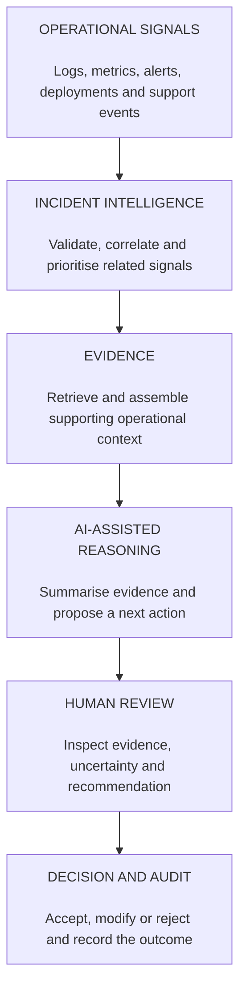
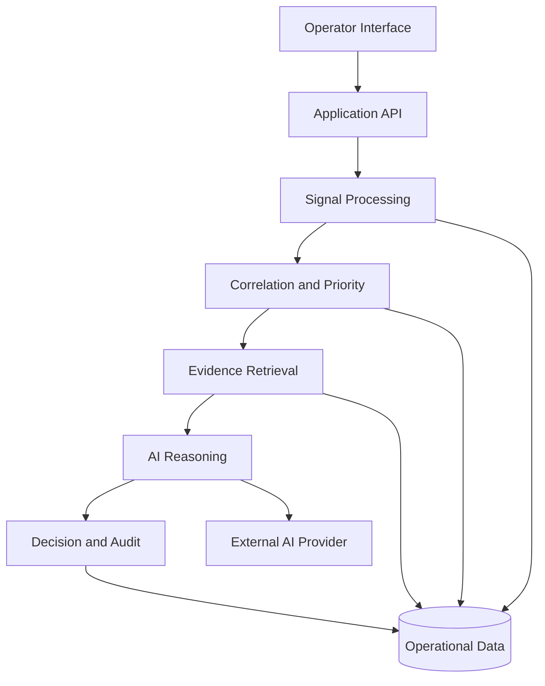
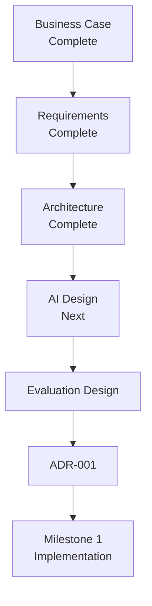

# Sigvora

**Trustworthy AI for Operational Intelligence**

Sigvora is an operational intelligence platform that helps teams turn fragmented system signals into correlated incidents, supporting evidence and actionable recommendations.

The project explores how AI can support operational decision-making without hiding uncertainty, separating conclusions from their evidence, or removing human oversight.

---

## The Problem

Modern software systems generate operational information across many sources:

- application logs;
- infrastructure metrics;
- monitoring alerts;
- deployment events;
- API health checks;
- customer-support reports.

A single incident can therefore appear as several disconnected signals.

For example:

| Time | Source | Signal |
|---|---|---|
| 10:02 | Deployment | Checkout service v2.4 deployed |
| 10:05 | Monitoring | API latency rises to 4.2 seconds |
| 10:06 | Application | HTTP 500 errors increase |
| 10:08 | Payments | Payment failure rate increases |
| 10:10 | Support | Customers report failed payments |
| 10:12 | Monitoring | Checkout degradation alert triggered |

These events may originate from different systems, but together they could describe the same underlying incident.

The operational challenge is therefore not simply detecting more alerts.

It is determining:

- which signals are related;
- what deserves attention first;
- what evidence supports that conclusion;
- what remains uncertain;
- what an operator should investigate next.

---

## What Sigvora Does

Sigvora provides a decision-support pipeline between operational signals and the people responsible for investigating them.



The output is intended to help an operator understand an incident rather than simply provide another alert.

A typical incident view may contain:

- correlated signals;
- incident priority;
- supporting evidence;
- an evidence-grounded summary;
- a proposed next action;
- uncertainty or conflicting evidence;
- a record of the operator's final decision.

---

## Trustworthy AI Approach

Sigvora treats AI as one component of the decision process rather than the source of truth.

The project is built around several principles.

### Evidence grounding

AI-generated conclusions should be based on evidence available to the system.

The operator should be able to inspect that evidence.

### Separation of evidence and inference

The system should distinguish between:

**what was observed** and **what the system inferred from those observations**.

This prevents generated explanations from being presented as raw facts.

### Uncertainty

Insufficient or conflicting evidence should not result in artificial certainty.

Where appropriate, Sigvora should communicate that additional investigation is required.

### Human oversight

AI can assist with analysis and recommend a next action.

The operator remains responsible for accepting, modifying or rejecting consequential recommendations.

### Safe failure

Failure of an AI component should not make the underlying incident evidence inaccessible.

The system should be capable of falling back to an evidence-only workflow.

### Evaluation

AI behaviour will be measured against defined datasets, baselines and evaluation criteria.

A convincing generated response is not treated as evidence that the system works.

---

## System Architecture

Sigvora will initially be implemented as a modular application.



The initial architecture deliberately avoids unnecessary distributed-system complexity.

The MVP does not require multiple microservices, Kubernetes, Kafka or other infrastructure simply to make the project appear more sophisticated.

Additional infrastructure will only be introduced when a requirement or measured limitation justifies it.

See [`docs/ARCHITECTURE.md`](docs/ARCHITECTURE.md) for the detailed architecture.

---

## Where AI Is Used

AI is not required for every stage of the system.

| Capability | Initial Approach |
|---|---|
| Input validation | Deterministic |
| Data normalisation | Deterministic |
| Signal correlation | Deterministic baseline with ML approaches evaluated where useful |
| Incident prioritisation | Explainable baseline with learned approaches evaluated where useful |
| Evidence retrieval | Retrieval techniques evaluated against a baseline |
| Incident summarisation | AI-assisted |
| Recommendation generation | AI-assisted |
| Audit records | Deterministic |
| Human approval | Human-controlled |

This separation makes it possible to determine whether AI actually improves a particular part of the workflow.

---

## Evaluation Strategy

Sigvora will begin with controlled operational scenarios where the correct relationships between signals are known independently of the system.

A scenario may contain:

```text
Known incident
    |
    |-- related operational signals
    |-- unrelated signals
    |-- expected priority
    |-- supporting evidence
    |-- expected investigation direction
```

Sigvora's output can then be compared with that ground truth.

The evaluation will investigate areas including:

| Area | Question |
|---|---|
| Correlation | Were related signals grouped correctly? |
| Detection | Were important incidents identified? |
| Prioritisation | Were important incidents ranked appropriately? |
| Retrieval | Was the correct evidence retrieved? |
| Grounding | Are generated claims supported by evidence? |
| Uncertainty | Does the system recognise insufficient evidence? |
| Reliability | What happens when components fail? |
| Performance | How long does the workflow take? |

Detailed metrics and experimental protocols will be defined in `docs/EVALUATION_DESIGN.md`.

Results will distinguish between synthetic, public and other data sources.

Negative or inconclusive experimental results will be retained.

---

## MVP Scope

The first implementation focuses on proving one complete workflow:

```text
Operational Signal
        |
        v
Incident Candidate
        |
        v
Supporting Evidence
        |
        v
Decision Support
        |
        v
Human Decision
        |
        v
Evaluation
```

### Included

- structured signal ingestion;
- validation and normalisation;
- signal correlation;
- incident prioritisation;
- evidence retrieval;
- evidence-grounded summaries;
- suggested next actions;
- uncertainty handling;
- human review;
- audit records;
- reproducible evaluation.

### Out of Scope

The MVP will not attempt to provide:

- autonomous production remediation;
- unrestricted autonomous agents;
- replacement of existing observability platforms;
- guaranteed root-cause analysis;
- enterprise-scale distributed infrastructure;
- foundation-model training.

---

## Proposed Technology Direction

| Area | Proposed Direction |
|---|---|
| Backend | Python and FastAPI |
| Data Validation | Pydantic |
| Persistence | PostgreSQL |
| Data Access | SQLAlchemy |
| AI Integration | Provider-independent interface |
| Frontend | React and TypeScript |
| Testing | Pytest |
| Python Environment | `uv` |
| Packaging | Docker |
| CI | GitHub Actions |

These are proposed engineering choices rather than permanent constraints.

Significant decisions will be justified through Architecture Decision Records.

---

## Repository Structure

The repository will evolve toward the following structure as implementation begins:

```text
Sigvora/
|
|-- src/
|   `-- sigvora/
|       |-- api/
|       |-- domain/
|       |-- ingestion/
|       |-- correlation/
|       |-- prioritisation/
|       |-- evidence/
|       |-- ai/
|       |-- decisions/
|       `-- audit/
|
|-- frontend/
|
|-- tests/
|   |-- unit/
|   |-- integration/
|   `-- evaluation/
|
|-- experiments/
|
|-- data/
|
|-- docs/
|
|-- pyproject.toml
|-- Dockerfile
|-- LICENSE
`-- README.md
```

Directories will be created when implementation requires them rather than being added prematurely.

---

## Documentation

The repository documentation follows a deliberate progression.

| Document | Question It Answers |
|---|---|
| [`BUSINESS_CASE.md`](docs/BUSINESS_CASE.md) | Why should Sigvora exist? |
| [`REQUIREMENTS.md`](docs/REQUIREMENTS.md) | What must the MVP achieve? |
| [`ARCHITECTURE.md`](docs/ARCHITECTURE.md) | How will the system be structured? |
| `AI_DESIGN.md` | How will AI be grounded and constrained? |
| `EVALUATION_DESIGN.md` | How will performance be measured? |
| `ADR/` | Why were major engineering decisions made? |

---

## Project Status

Sigvora is currently in **Milestone 0: Product and Engineering Foundation**.



Implementation begins after the core product, architecture, AI and evaluation decisions are sufficiently defined.

---

## Engineering Standard

Sigvora is being developed around the following evidence chain:

```text
Business Problem
      |
      v
Requirement
      |
      v
Architecture
      |
      v
Implementation
      |
      v
Test
      |
      v
Evaluation
      |
      v
Evidence
```

The objective is not to create a demonstration that merely appears intelligent.

The objective is to build a system whose important behaviour can be **explained, tested and evaluated**.

---

## License

See [`LICENSE`](LICENSE) for licensing information.
