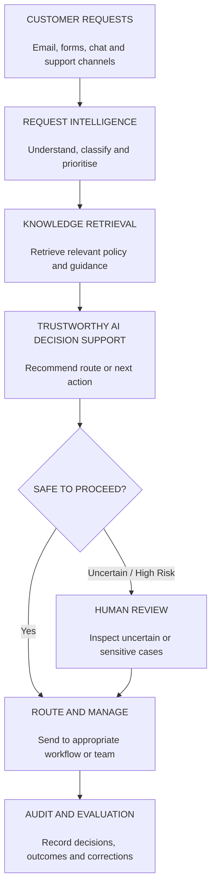
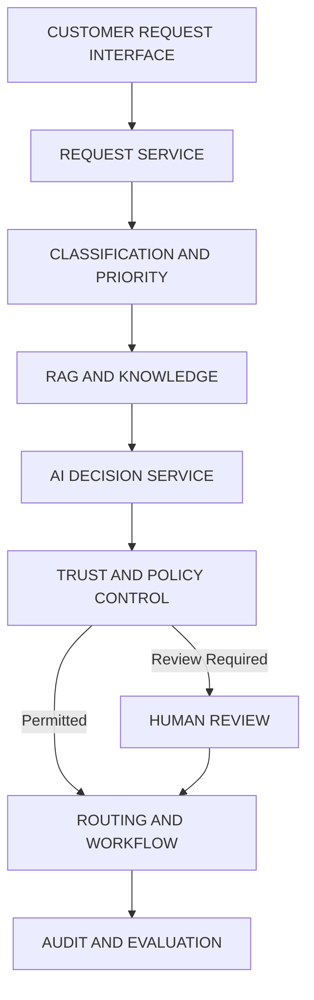
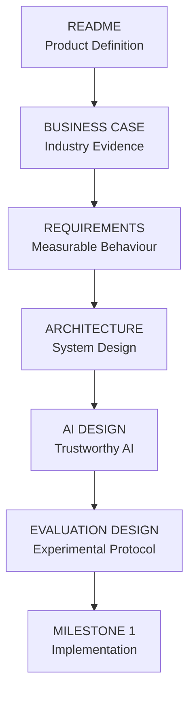

# Sigvora

**Trustworthy AI for Customer Request Intelligence**

Sigvora is an AI-powered customer-request intelligence platform designed to help organisations classify, prioritise, route and manage incoming customer requests.

Unlike a conventional chatbot that primarily generates responses, Sigvora focuses on a different problem:

> **How should this request be handled, how reliable is the AI's decision, and when should a human take over?**

The project combines request classification, prioritisation, Retrieval-Augmented Generation (RAG), uncertainty-aware decision controls, human oversight and continuous evaluation within one operational workflow.

---

## The Problem

Customer-service teams receive requests through channels such as email, web forms, chat and support systems.

Those requests can vary significantly.

```text
"How do I update my address?"

"I was charged twice."

"I don't recognise this transaction."

"I cannot make my repayment this month."

"My account has been locked."

"I want to make a formal complaint."
```

Before many of these requests can be resolved, someone or something must determine:

- what the customer needs;
- how urgent the request is;
- which team should handle it;
- which organisational policy applies;
- whether the request is sensitive or high-risk;
- whether automation is appropriate.

At scale, this creates a request-triage and decision problem.

Sigvora explores whether AI can support that process without assuming that every AI prediction should automatically be trusted.

---

## What Sigvora Does

Sigvora sits between incoming customer requests and the teams responsible for handling them.



The objective is not maximum automation.

The objective is **useful automation with controlled risk**.

---

## Case Study

Sigvora is designed as an industry-agnostic platform.

Its first implementation will be demonstrated through a **fictional UK financial-services organisation**.

The case study gives the project realistic request categories, routing rules, organisational policies and higher-risk scenarios without representing a real financial institution or using private customer information.

Example requests include:

| Request | Possible Handling |
|---|---|
| Change account address | Account Support |
| Card has not arrived | Card Support |
| Duplicate payment | Payments |
| Unrecognised transaction | Fraud / Disputes |
| Unable to make repayment | Specialist human review |
| Account access problem | Account Support |
| Formal complaint | Complaints workflow |

The expected handling shown here represents the fictional case-study design and is not a claim about the procedures of any real financial institution.

---

## Why This Is Not Just a Chatbot

A conventional chatbot primarily tries to answer:

> **What should I say to this customer?**

Sigvora is designed to answer a broader operational question:

> **What should happen to this request?**

That requires several capabilities working together.

| Capability | Basic Chatbot | Basic RAG App | Sigvora |
|---|---:|---:|---:|
| Generate text | Yes | Yes | Yes |
| Retrieve organisational knowledge | Limited | Yes | Yes |
| Classify requests | Optional | Optional | Core |
| Assess priority | Limited | Limited | Core |
| Recommend routing | Limited | Limited | Core |
| Detect sensitive cases | Limited | Limited | Required |
| Represent uncertainty | Limited | Limited | Required |
| Defer decisions | Limited | Limited | Required |
| Human override | Optional | Optional | Required |
| Audit AI decisions | Limited | Limited | Required |
| Evaluate decision quality | Usually separate | Usually separate | Core |

RAG and LLMs are therefore components of Sigvora rather than the product itself.

---

## Where RAG Fits

Retrieval-Augmented Generation provides Sigvora with relevant organisational knowledge before an AI-assisted recommendation is produced.

For example:

```text
Customer Request
       |
       v
Request Classification
       |
       v
Retrieve Relevant Policy
       |
       v
Build Evidence Context
       |
       v
AI-Assisted Recommendation
       |
       v
Validate Decision
```

The retrieved context may include fictional case-study material such as:

- request-handling policies;
- escalation procedures;
- routing guidance;
- complaint procedures;
- service information.

This supports a key design principle:

> **Retrieve evidence before generating recommendations.**

Retrieval quality and generated claims will be evaluated independently.

---

## Trustworthy AI

Trustworthiness is treated as an engineering requirement rather than a label added to the project.

### Grounding

Recommendations should be supported by the customer request and relevant retrieved evidence.

### Uncertainty

The system should recognise when available information is insufficient, ambiguous or conflicting.

### Selective Automation

A model producing a prediction does not automatically mean the system should act on it.

Low-confidence, sensitive or policy-restricted cases can be deferred for human review.

### Human Oversight

Operators should be able to inspect, accept, modify or reject AI-assisted decisions.

### Auditability

Important AI decisions should retain sufficient information to reconstruct what was recommended, what evidence was available and what action was ultimately taken.

### Safe Failure

Failure of an AI provider should not remove the underlying customer request or prevent an operator from handling it manually.

---

## Decision Policy

The core workflow can be represented conceptually as:

```text
request = ingest_customer_request()

classification = classify(request)
priority = assess_priority(request)

evidence = retrieve_relevant_knowledge(
    request,
    classification
)

recommendation = generate_recommendation(
    request,
    classification,
    priority,
    evidence
)

risk = assess_decision_risk(
    request,
    classification,
    priority,
    evidence,
    recommendation
)

if risk.requires_human_review:
    defer_to_human()

elif evidence.is_insufficient:
    abstain_and_escalate()

else:
    execute_permitted_workflow()

record_decision_and_outcome()
```

This is intentionally different from:

```text
request -> LLM -> answer
```

The AI operates inside a controlled decision process.

---

## The Engineering Question

The project is centred on a measurable question:

> **How can Sigvora maximise useful AI-assisted request handling while maintaining reliable decision quality and escalating cases where automation should not be trusted?**

This creates several technical problems to investigate:

- request classification;
- priority prediction;
- routing accuracy;
- retrieval quality;
- grounded generation;
- uncertainty estimation;
- confidence calibration;
- sensitive-case detection;
- selective automation;
- human-AI decision workflows.

---

## Evaluation

Sigvora will be evaluated using datasets with independently defined expected outcomes.

The initial benchmark will use reproducible synthetic customer requests representing the fictional case-study organisation.

Each evaluated request can contain ground truth such as:

```text
request
expected_category
expected_priority
expected_route
sensitive_case
expected_human_review
relevant_policy
```

Predictions can then be compared with expected outcomes.

Initial evaluation areas include:

| Area | Example Measure |
|---|---|
| Classification | Precision, recall, F1 |
| Routing | Routing accuracy |
| Priority | Priority classification performance |
| Retrieval | Recall@K / ranking quality |
| Grounding | Supported vs unsupported claims |
| Uncertainty | Calibration quality |
| Selective automation | Coverage vs error rate |
| Sensitive cases | Recall / missed escalation rate |
| Reliability | Failure and fallback behaviour |
| Performance | Processing latency |

Exact metrics and acceptance thresholds will be defined before results are reported.

---

## Coverage vs Risk

One of the central experiments will investigate the relationship between automation and reliability.

If Sigvora processes only cases where the system has strong evidence, fewer requests may be automated but decision quality may improve.

If the threshold is lowered, more requests may be automated while the risk of incorrect decisions may increase.

The objective is therefore not:

```text
Automate everything.
```

It is:

```text
Automate where justified.
Escalate where uncertain.
Measure both.
```

This trade-off will form an important part of the project's Trustworthy AI evaluation.

---

## Proposed Architecture

Sigvora will initially use a modular architecture rather than unnecessary distributed infrastructure.



The architecture will begin as a modular monolith.

Additional infrastructure will only be introduced where requirements or measured limitations justify it.

---

## Proposed Technology Direction

| Area | Proposed Direction |
|---|---|
| Backend | Python + FastAPI |
| Validation | Pydantic |
| Database | PostgreSQL |
| Data Access | SQLAlchemy |
| AI Integration | Provider-independent LLM interface |
| Retrieval | Embeddings + evaluated retrieval layer |
| Frontend | React + TypeScript |
| Testing | Pytest |
| Python Environment | `uv` |
| Packaging | Docker |
| CI | GitHub Actions |

These are proposed engineering choices rather than fixed requirements.

Major decisions will be documented using Architecture Decision Records.

---

## MVP Boundary

The first version will prove one complete workflow:

```text
Customer Request
      |
      v
Classification
      |
      v
Priority
      |
      v
Evidence Retrieval
      |
      v
Recommendation
      |
      v
Trust Decision
      |
      +--------> Human Review
      |
      v
Routing
      |
      v
Audit
```

The MVP will not attempt to build:

- a complete banking platform;
- a replacement for an enterprise CRM;
- unrestricted autonomous agents;
- autonomous financial decision-making;
- foundation models from scratch;
- unnecessary microservice infrastructure.

---

## Documentation

The project documentation follows the engineering lifecycle.

| Document | Purpose |
|---|---|
| `docs/BUSINESS_CASE.md` | Industry problem, opportunity and business hypothesis |
| `docs/REQUIREMENTS.md` | Functional, AI, security and evaluation requirements |
| `docs/ARCHITECTURE.md` | System boundaries and technical architecture |
| `docs/AI_DESIGN.md` | Models, RAG, uncertainty and trustworthy AI controls |
| `docs/EVALUATION_DESIGN.md` | Datasets, baselines, experiments and metrics |
| `docs/adr/` | Major engineering decisions |

---

## Current Status

**Milestone 0 — Problem Definition and System Design**



No performance claims will be presented as results until they are supported by recorded experiments.

---

## Evidence Standard

Sigvora follows a simple engineering evidence chain:

```text
Industry Problem
      |
      v
Business Requirement
      |
      v
System Design
      |
      v
Implementation
      |
      v
Test
      |
      v
Experiment
      |
      v
Evidence
      |
      v
Business Interpretation
```

Throughout the repository, the project will distinguish between:

**Hypothesis** — what we believe may improve.

**Target** — the performance level defined before evaluation.

**Result** — what an experiment actually demonstrates.

The objective is not to make Sigvora appear intelligent.

The objective is to determine, with evidence, **where its AI can be trusted, where it cannot, and how that distinction should affect real operational workflows.**

---

## Disclaimer

Sigvora is a portfolio and research engineering project.

The financial-services organisation, customer requests, policies, workflows and datasets used in the initial case study are fictional or synthetic unless explicitly identified otherwise.

They do not represent the procedures or customers of any real financial institution.

---

## License

See [`LICENSE`](LICENSE) for licensing information.
