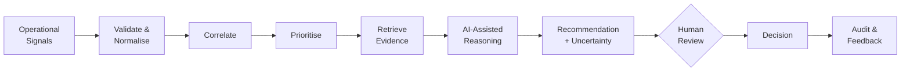
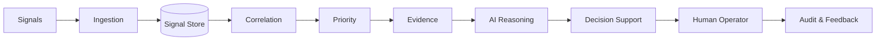

# Sigvora

> **Trustworthy AI for Operational Intelligence**

**From operational noise to evidence-grounded action.**

Sigvora is an AI-assisted operational intelligence platform designed to help teams turn fragmented system signals into **correlated incidents, prioritised insights and evidence-grounded recommendations** while keeping humans in control of consequential decisions.

Rather than treating every alert independently, Sigvora asks:

> **Which signals belong together, what evidence supports the conclusion, how important is the incident, and what should an operator investigate next?**

---

## The Problem

Modern digital systems generate signals across monitoring tools, application logs, deployments, infrastructure, APIs and customer-support channels.

A single incident may appear as several disconnected events:

```text
10:02  Checkout service deployed
10:05  API latency increases
10:06  HTTP 500 errors increase
10:08  Payment failures increase
10:10  Customers report failed payments
10:12  Checkout degradation alert triggered
```

Individually, these are signals.

Together, they may describe **one operational incident**.

Operators must often make that connection manually while deciding what deserves attention first.

Sigvora is designed to assist with that reasoning.

---

## What Sigvora Does



The goal is not simply to generate an AI response.

The goal is to provide an operator with:

- related signals;
- incident priority;
- supporting evidence;
- a grounded summary;
- a suggested next action;
- uncertainty where evidence is incomplete;
- control over the final decision.

---

## Why Trustworthy AI?

Sigvora treats AI as a **decision-support component**, not the source of truth.

The project is built around five principles:

### Evidence Grounding
AI conclusions should be supported by available operational evidence.

### Explicit Uncertainty
Weak or conflicting evidence should not be presented as certainty.

### Human Oversight
Operators can inspect, accept, modify or reject recommendations.

### Safe Failure
If an AI component is unavailable, the underlying evidence remains accessible.

### Measurable Claims
AI performance must be demonstrated through evaluation rather than assumed from convincing output.

---

## Architecture

Sigvora starts as a **modular application** with clear component boundaries.



The MVP deliberately avoids unnecessary distributed infrastructure.

Technologies such as microservices, event streaming or specialised vector infrastructure will only be introduced when requirements or measured limitations justify them.

See [`docs/ARCHITECTURE.md`](docs/ARCHITECTURE.md) for the system design.

---

## How Sigvora Will Be Evaluated

The project will use controlled operational scenarios with independently defined ground truth.

Evaluation will investigate questions such as:

- Can Sigvora correctly associate related signals?
- Can it identify important incidents?
- Can it retrieve the correct supporting evidence?
- Are generated conclusions supported by that evidence?
- Does it communicate uncertainty appropriately?
- What happens when AI components fail?
- Does decision support improve the workflow compared with a defined baseline?

The project will report negative and inconclusive results rather than presenting only successful demonstrations.

---

## MVP Scope

The first implementation focuses on one complete workflow:

> **Signal → Incident → Evidence → Recommendation → Human Decision → Evaluation**

### Included

- structured signal ingestion;
- validation and normalisation;
- incident correlation;
- priority assessment;
- evidence retrieval;
- grounded AI summaries;
- suggested next actions;
- uncertainty handling;
- human review;
- audit history;
- reproducible evaluation.

### Not Included

- autonomous production remediation;
- unrestricted AI agents;
- replacement of observability platforms;
- guaranteed root-cause analysis;
- unnecessary enterprise-scale infrastructure.

---

## Proposed Technology Direction

| Area | Direction |
|---|---|
| Backend | Python + FastAPI |
| Validation | Pydantic |
| Persistence | PostgreSQL |
| Data Access | SQLAlchemy |
| AI | Provider-independent interface |
| Frontend | React + TypeScript |
| Testing | Pytest |
| Python Environment | `uv` |
| Packaging | Docker |
| CI | GitHub Actions |

Technology choices remain subject to implementation evidence and Architecture Decision Records.

---

## Project Documentation

| Document | Purpose |
|---|---|
| [`BUSINESS_CASE.md`](docs/BUSINESS_CASE.md) | Why Sigvora should exist |
| [`REQUIREMENTS.md`](docs/REQUIREMENTS.md) | What the MVP must achieve |
| [`ARCHITECTURE.md`](docs/ARCHITECTURE.md) | How the system is structured |
| `AI_DESIGN.md` | How trustworthy AI is designed |
| `EVALUATION_DESIGN.md` | How performance will be measured |
| `ADR/` | Why major engineering decisions were made |

---

## Current Status

**Milestone 0 — Product & Research Foundation**


The current focus is establishing a **clear, testable and defensible foundation before implementation begins**.

---

## Project Standard

Every important capability should eventually have an evidence trail:

> **Business Need → Requirement → Architecture → Code → Test → Evaluation → Evidence**

A feature is not considered successful merely because it works in a demonstration.

It should be possible to explain:

**why it exists, how it works, how it was tested, and what evidence supports its performance.**

---

## License

See [`LICENSE`](LICENSE) for repository licensing information.

---

**Sigvora** — *Trustworthy AI should support decisions, not conceal how they were made.*
