# Sigvora — System Architecture

> **Status:** Architecture Baseline  
> **Version:** 0.3.0  
> **Project:** Sigvora  
> **Product:** Trustworthy AI Customer-Request Intelligence and Decision-Support Platform  
> **Demonstration Domain:** Fictional UK Financial Services  
> **Architecture Style:** Modular Monolith

---

## 1. Purpose

Sigvora helps organisations understand, prioritise, route and safely act
on customer requests using evidence-grounded AI, organisational knowledge
and explicit governance controls.

This document explains how the main parts of Sigvora work together.

The architecture is designed around one question:

> **How can Sigvora turn an unstructured customer request into a useful,
> evidence-grounded and safely governed operational decision?**

---

## 2. What Sigvora Does

A customer may submit a simple request:

> "Please send me my latest statement."

or something requiring more careful handling:

> "My card was stolen yesterday and there are payments showing that I
> didn't make."

These messages should not necessarily receive the same priority, routing
or level of AI autonomy.

Sigvora therefore processes each request through a controlled decision
pipeline.

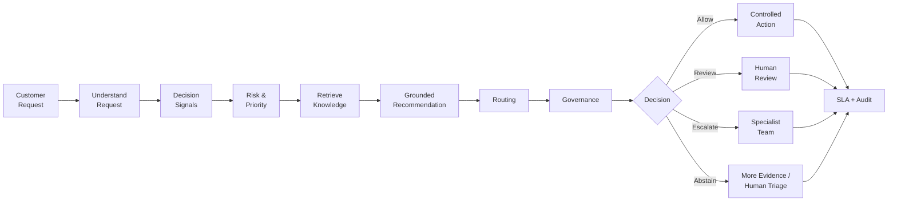

### What this means

Sigvora does not simply send a customer message to an LLM and return its
answer.

It progressively builds evidence about:

- what the customer needs;
- what important facts are present;
- how serious and urgent the case is;
- what organisational knowledge applies;
- what should happen next;
- who should handle it;
- and whether AI has sufficient authority to proceed.

---

## 3. Product Boundary

Sigvora is specifically a:

> **Trustworthy AI customer-request intelligence and decision-support
> platform.**

It is not:

- a generic chatbot;
- a standalone RAG demonstration;
- a sentiment-analysis application;
- a CRM replacement;
- a banking core system;
- a fraud-detection system;
- an infrastructure-monitoring platform;
- or an unrestricted autonomous agent.

The initial portfolio uses a fictional UK financial-services organisation
because requests involving payments, cards, complaints, financial
difficulty and privacy create meaningful differences in risk, evidence
and human-oversight requirements.

---

## 4. Architecture Style

Sigvora starts as a **modular monolith**.

### What does that mean?

The backend is deployed as one application, but its responsibilities are
separated into clear modules.

For example:

```text
Request Management
Request Understanding
Risk & Priority
Knowledge Retrieval
Recommendation
Routing
Governance
Human Review
SLA
Audit
```

This gives Sigvora clear engineering boundaries without creating many
independent services before there is a genuine need for them.

### Why not start with microservices?

Microservices would introduce additional deployment, networking,
monitoring and data-consistency complexity.

Sigvora does not currently have evidence that it needs that complexity.

The initial architectural principle is therefore:

> **Separate responsibilities first. Separate deployments only when a
> real requirement justifies it.**

---

## 5. High-Level Architecture

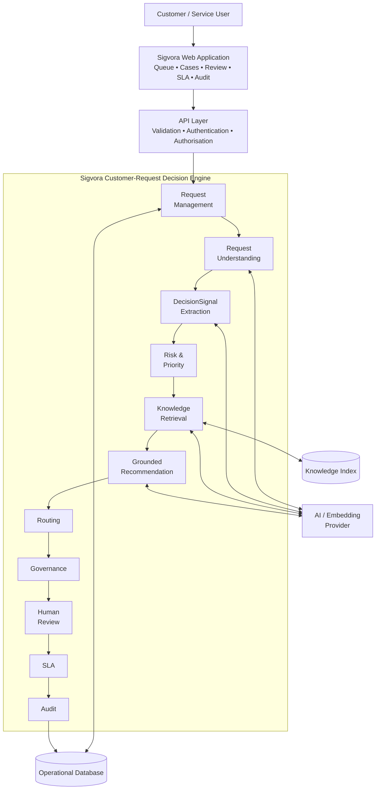

### What this diagram tells us

The **web application** is where agents and reviewers work with customer
cases.

The **API layer** validates requests and protects application operations.

The **decision engine** contains the actual Sigvora business workflow.

The **operational database** stores customer cases and their decision
history.

The **knowledge index** supports retrieval of approved organisational
knowledge.

The **AI provider** assists with language-understanding tasks where AI is
appropriate.

AI therefore supports Sigvora.

It does not control the entire system.

---

## 6. Request Understanding

The first intelligence task is understanding what the customer wants.

Consider:

```text
"I transferred £4,800 yesterday and the recipient
still hasn't received it."
```

Sigvora may produce:

```text
Intent:
Payment investigation

Category:
Payment Issue

Relevant entity:
Amount = £4,800
```

This is called **request understanding**.

Its purpose is to convert natural customer language into structured
information that the rest of the system can use.

---

## 7. DecisionSignal

Sigvora also identifies **DecisionSignals**.

A DecisionSignal is:

> **An important fact or indicator in a customer request that may change
> how the request should be assessed or handled.**

For example:

```text
"My card was stolen and there are three payments
that I don't recognise."
```

may produce:

```text
STOLEN_CARD

UNRECOGNISED_TRANSACTION

POSSIBLE_FINANCIAL_EXPOSURE
```

These are different from the customer's intent.

The **intent** describes what the customer is trying to achieve.

The **DecisionSignals** describe important circumstances that should
influence the decision.

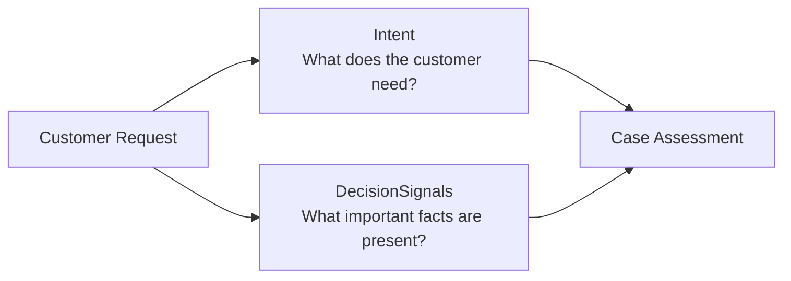

Keeping these concepts separate makes later risk and routing decisions
more explainable and testable.

---

## 8. Risk and Priority

Risk and priority are related, but they do not mean the same thing.

### Risk

Risk asks:

> **What could happen if this request is misunderstood, delayed or handled
> incorrectly?**

Potential factors include:

- customer harm;
- financial exposure;
- security;
- privacy;
- vulnerability;
- and service impact.

Initial risk levels are:

```text
LOW
MEDIUM
HIGH
CRITICAL
```

### Priority

Priority asks:

> **How urgently should the organisation handle this request?**

Initial priorities are:

```text
P1 — Critical
P2 — High
P3 — Normal
P4 — Low
```

The relationship is therefore:

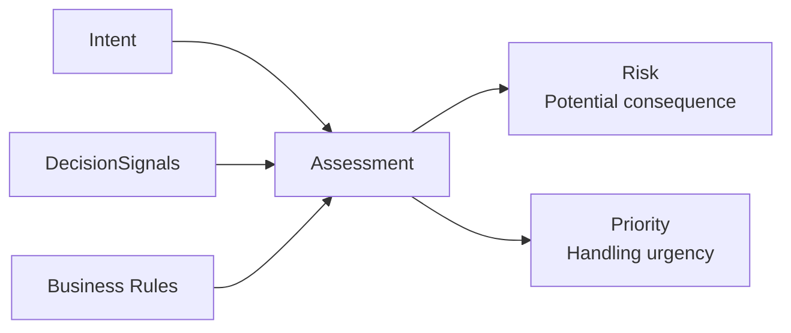

Sigvora should not rely solely on an LLM to decide risk.

Known business rules can provide deterministic controls while AI helps
interpret natural language.

---

## 9. Sentiment Is Not Risk

This distinction is important.

A customer saying:

> "I'm furious that my statement hasn't arrived."

may express strong negative sentiment.

Another customer may calmly say:

> "I don't recognise these three payments."

The second request may represent substantially greater operational risk.

Therefore:

```text
Sentiment ≠ Risk
Emotion   ≠ Priority
Tone      ≠ Urgency
```

Sigvora may use sentiment as contextual information, but sentiment alone
must not determine risk or priority.

---

## 10. Organisational Knowledge and RAG

Some customer requests require organisational knowledge before Sigvora
can make a useful recommendation.

Examples include:

- payment investigation procedures;
- fraud/card-security procedures;
- complaint guidance;
- financial-difficulty procedures;
- privacy guidance;
- escalation rules;
- and SLA rules.

Sigvora uses **Retrieval-Augmented Generation (RAG)** for this purpose.

### What RAG means here

Instead of expecting an AI model to remember organisational policy,
Sigvora searches an approved knowledge collection and gives relevant
evidence to the model.

RAG is therefore a supporting mechanism.

> **RAG is not Sigvora's product.**

---

## 11. RAG Architecture

RAG has two separate stages.

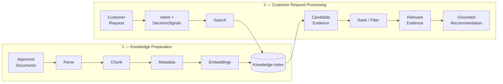

### Why separate the two?

Knowledge preparation happens when approved organisational documents are
added or updated.

Retrieval happens when Sigvora needs evidence for a particular customer
request.

Keeping them separate makes the system easier to test and maintain.

---

## 12. Evidence Is a First-Class Object

Evidence should not disappear inside an AI prompt.

Sigvora should retain information such as:

```text
Evidence
├── document
├── section / chunk
├── relevance
├── version
└── retrieval time
```

This allows a user to see:

> **Which organisational information supported this recommendation?**

It also allows us to evaluate whether Sigvora retrieved the correct
information.

---

## 13. Evidence-Grounded Recommendation

Once relevant knowledge has been retrieved, Sigvora can generate a
recommended next step.

Conceptually:

```text
Customer Request
+
Intent
+
DecisionSignals
+
Risk
+
Priority
+
Relevant Evidence
────────────────────────
Grounded Recommendation
```

A recommendation should contain:

```text
Recommended Action
Reason
Supporting Evidence
Uncertainty
```

The recommendation is still a **proposal**.

It is not automatically authorised.

---

## 14. Fact, Evidence and Inference

Sigvora must distinguish three things.

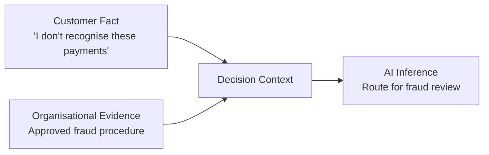

### Customer fact

Something the customer actually reported.

### Organisational evidence

Information retrieved from an approved organisational source.

### AI inference

A conclusion generated from the available information.

This prevents an AI-generated conclusion from being presented as though
it were a verified customer or organisational fact.

---

## 15. Routing

Routing answers:

> **Who should handle this request?**

Possible destinations in the demonstration environment include:

```text
Customer Support
Digital Support
Payments Investigation
Fraud / Card Security
Complaints
Financial Support
Privacy / Data
Human Triage
```

For example:

```text
Potential fraud
+
Stolen card
+
Unrecognised transactions
+
High risk
──────────────────────────
Fraud / Card Security
```

Where stable business rules exist, routing should use those rules rather
than unnecessarily asking an LLM to make the decision.

---

## 16. RSG — Risk, Signal, Governance

RSG is Sigvora's supporting decision-control model.

It is **not the product itself**.

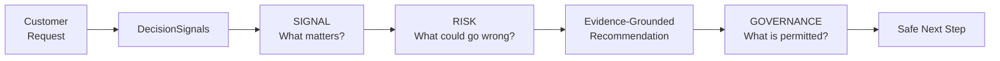

### Signal

What important indicators are present?

### Risk

What could happen if those indicators are mishandled?

### Governance

Given the evidence, risk and uncertainty, what is Sigvora permitted to
do?

This gives RSG a clear role without allowing it to replace Sigvora's
customer-request purpose.

---

## 17. Governance

Governance separates:

> **What AI recommends**

from:

> **What the system is authorised to do.**

Sigvora supports four initial governance outcomes:

```text
ALLOW
REVIEW
ESCALATE
ABSTAIN
```

### ALLOW

A permitted low-risk workflow may continue.

### REVIEW

A human must confirm the recommendation.

### ESCALATE

The case requires specialist human handling.

### ABSTAIN

Sigvora does not have sufficient evidence or certainty to make a reliable
recommendation.

---

## 18. AI Cannot Authorise Itself

The following design is not acceptable:

```text
LLM → Recommendation → LLM says it is safe → Action
```

Sigvora instead uses:

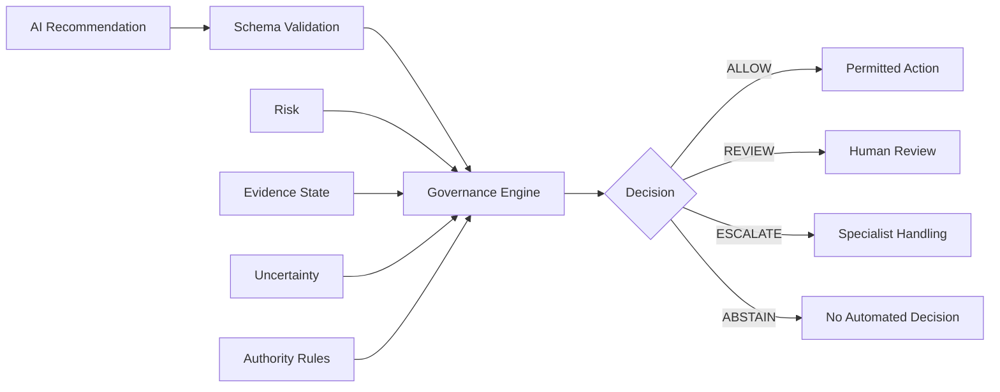

This implements an important Sigvora principle:

> **AI capability does not equal operational authority.**

---

## 19. Human-in-the-Loop

Human review is part of the architecture rather than an emergency
fallback added later.

A human may be required when:

- risk is high;
- confidence is low;
- evidence is missing;
- evidence conflicts;
- the situation is sensitive;
- or governance requires approval.

A reviewer may:

```text
Approve
Reject
Modify
Reroute
Escalate
Request More Information
```

Sigvora preserves both the original AI recommendation and the human
decision.

This makes disagreement measurable rather than hiding it.

---

## 20. SLA Tracking

SLA tracking answers:

> **How long does the organisation have to handle this request?**

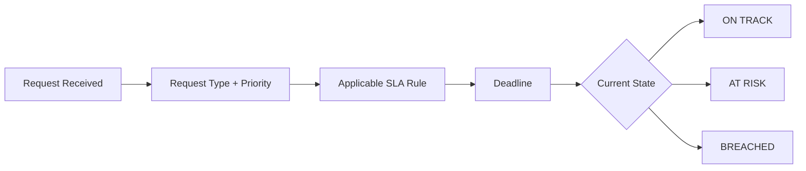

Deadline calculations are deterministic.

An LLM is not needed to perform basic time arithmetic.

---

## 21. End-to-End Processing Sequence

The following diagram shows what happens when Sigvora receives a customer
request.

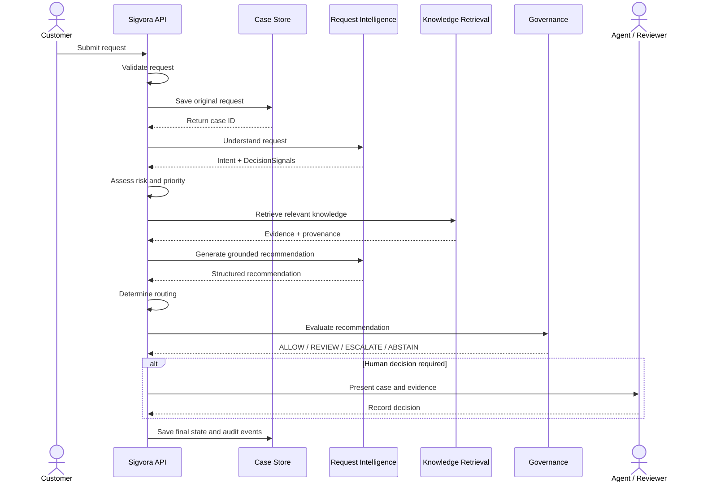

This sequence represents the core Sigvora product behaviour.

---

## 22. Data Model

The customer request is the central domain object.

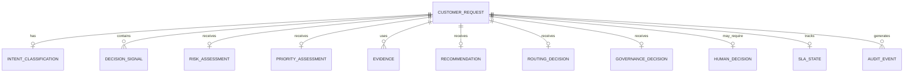

### Why structure the data this way?

We want to reconstruct a case later rather than storing only a final AI
answer.

For example:

```text
Customer Request
      ↓
What Sigvora understood
      ↓
Which signals it detected
      ↓
Why risk was assigned
      ↓
Which evidence was retrieved
      ↓
What AI recommended
      ↓
What governance allowed
      ↓
What the human decided
```

That structure supports explainability, auditing and evaluation.

---

## 23. Source of Truth

The operational database is the authoritative source for customer-case
state.

The knowledge index serves a different purpose:

```text
Operational Database
→ Customer cases and decisions
→ SOURCE OF TRUTH
```

```text
Knowledge Index
→ Searchable organisational knowledge
→ RETRIEVAL STRUCTURE
```

The retrieval index should not become the authoritative store for
customer cases.

---

## 24. Safe Failure

Trustworthy AI must define what happens when things go wrong.

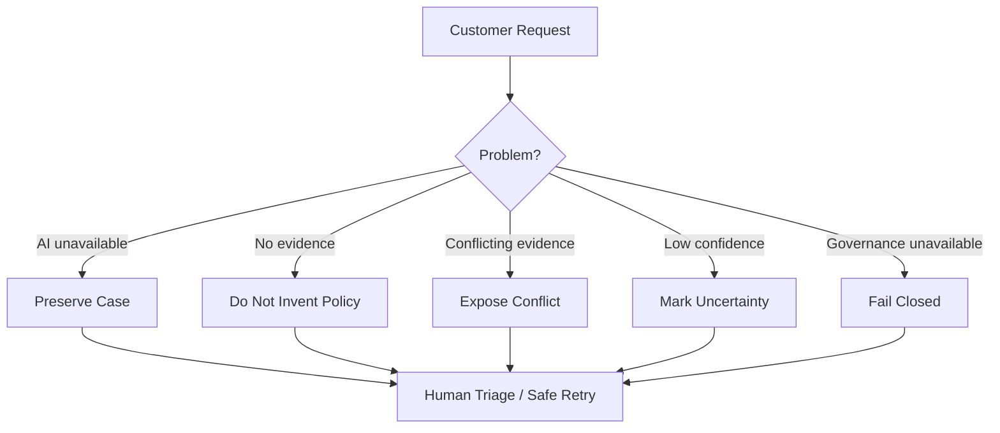

Examples:

**AI unavailable:** preserve the request and allow human handling.

**No evidence:** do not fabricate organisational policy.

**Conflicting evidence:** expose the conflict rather than choosing a
source silently.

**Low confidence:** allow abstention or human review.

**Governance failure:** do not assume permission.

---

## 25. Auditability

Sigvora should record important events such as:

```text
Request Received
Intent Classified
DecisionSignal Identified
Risk Assessed
Priority Assigned
Evidence Retrieved
Recommendation Generated
Routing Selected
Governance Evaluated
Human Override
SLA Escalated
Case Resolved
```

The goal is to answer:

> **How did Sigvora reach this decision?**

An audit trail should therefore preserve relevant system, human, AI,
evidence and policy information.

---

## 26. Security Boundary

Customer messages, retrieved documents and model outputs must be treated
as untrusted input.

They must not be able to redefine:

```text
System Instructions
Permissions
Governance Rules
Authorisation Rules
```

A generated recommendation should therefore follow:

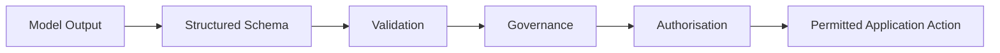

The LLM does not receive unrestricted authority over application actions.

---

## 27. Evaluation Is Part of the Architecture

Sigvora cannot claim to be trustworthy simply because the application
works.

Its behaviour must eventually be measured.

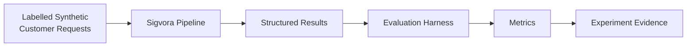

Evaluation should cover:

| Capability | Example Measure |
|---|---|
| Intent classification | Macro F1 |
| DecisionSignal detection | Precision / Recall / F1 |
| Risk assessment | Classification performance |
| Priority | Correct priority rate |
| Routing | First-time routing accuracy |
| Retrieval | Precision@K / Recall@K |
| Grounding | Evidence-supported recommendation rate |
| Abstention | Appropriate abstention rate |
| Governance | Policy-compliance rate |
| Human oversight | Override / escalation rate |

Actual thresholds will be defined in `EVALUATION_DESIGN.md`.

---

## 28. Proposed Technology Direction

Technology should support the architecture rather than define the
product.

| Layer | Proposed Direction | Why |
|---|---|---|
| Frontend | React + TypeScript | Interactive queue, case and review interfaces |
| Backend | Python + FastAPI | Typed APIs and strong AI ecosystem |
| Operational Data | PostgreSQL | Relational case and decision history |
| Retrieval | PostgreSQL vector capability or justified equivalent | Keep initial infrastructure manageable |
| AI | Provider abstraction | Avoid unnecessary dependency on one model |
| Testing | Unit + Integration + AI Evaluation | Test deterministic and AI behaviour separately |
| Packaging | Docker | Reproducible environments |
| CI/CD | GitHub Actions | Automated repository validation |
| Observability | Structured logs + metrics | Inspect application and AI behaviour |

These are proposed choices.

They are not claims that the technologies have already been implemented.

---

## 29. Architecture Invariants

The following rules protect Sigvora from architectural drift.

1. The original customer request is preserved.
2. Sentiment alone cannot determine risk or priority.
3. AI inference is not presented as customer fact.
4. Policy-dependent recommendations require relevant evidence.
5. Missing evidence must not result in fabricated policy.
6. High AI confidence does not grant authority.
7. AI cannot bypass governance.
8. Human overrides preserve the original AI recommendation.
9. AI failure must not lose the customer request.
10. Sensitive actions fail safely when authority cannot be established.
11. Trustworthy AI claims require evaluation evidence.
12. Every major component must support the customer-request decision lifecycle.

---

## 30. Architecture Validation Scenario

Consider:

> "My card was stolen yesterday and now there are three transactions
> totalling £650 that I don't recognise."

Sigvora should conceptually process it as:

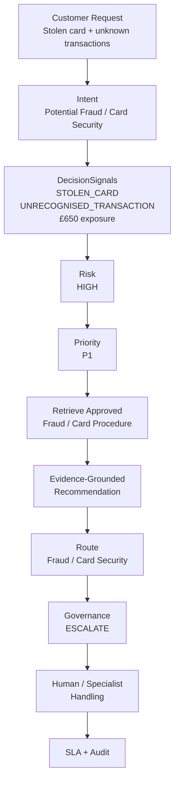

This scenario provides a simple architecture test:

> **If a proposed Sigvora component does not meaningfully contribute to
> this customer-request decision process, why is it in the core
> architecture?**

---

## 31. Architecture Status

This document describes the **target architecture**.

It does not claim that:

- every component has been implemented;
- the AI has achieved acceptable accuracy;
- RAG quality has been validated;
- governance effectiveness has been proven;
- Sigvora is certified for financial-services production;
- or the platform has been tested at enterprise scale.

The portfolio will distinguish between:

```text
DESIGNED → IMPLEMENTED → TESTED → EVALUATED → DEPLOYED
```

This prevents design intentions from being presented as implementation
evidence.

---

## 32. Next Document

The next design document is:

`docs/AI_DESIGN.md`

It will answer a narrower question:

> **How should AI and RAG perform their specific responsibilities inside
> the Sigvora customer-request decision process?**

It will cover:

- intent classification;
- DecisionSignal extraction;
- structured AI outputs;
- uncertainty;
- RAG retrieval;
- evidence grounding;
- recommendation generation;
- abstention;
- prompt boundaries;
- model/provider abstraction;
- AI failure handling;
- AI observability;
- and evaluation hooks.

AI design will remain subordinate to the Sigvora product architecture
defined here.
