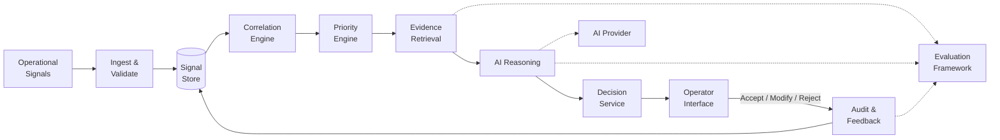
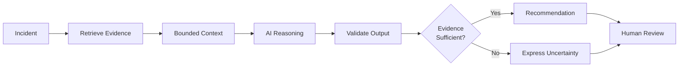
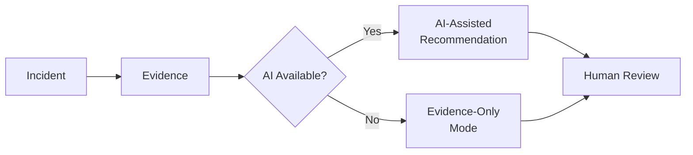
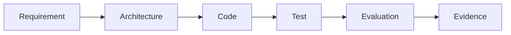

# Signaly — System Architecture

> **Trustworthy AI for Operational Intelligence**

| | |
|---|---|
| **Version** | 1.0 |
| **Status** | Proposed |
| **Scope** | MVP |
| **Depends On** | `BUSINESS_CASE.md`, `REQUIREMENTS.md` |

---

## 1. Architecture Goal

Signaly transforms fragmented operational signals into **evidence-grounded, uncertainty-aware recommendations** while keeping humans responsible for consequential decisions.

The architecture follows four rules:

1. **Preserve the evidence** — original signals remain accessible.
2. **Use AI selectively** — deterministic software handles tasks that do not require AI.
3. **Keep humans in control** — AI recommends; operators decide.
4. **Start simple** — infrastructure complexity must be justified by requirements.

---

## 2. System Architecture



### What happens

**1. Ingest & Validate**  
Operational signals enter through a defined interface and are converted into a consistent format.

**2. Correlate**  
Potentially related signals are grouped into incident candidates.

**3. Prioritise**  
Incidents are ranked using available operational evidence.

**4. Retrieve Evidence**  
Relevant signals and context are assembled before AI reasoning occurs.

**5. AI Reasoning**  
AI produces a grounded summary and possible next action from the supplied evidence.

**6. Human Decision**  
The operator inspects the evidence and can accept, modify or reject the recommendation.

**7. Audit & Evaluate**  
The recommendation, evidence and human decision are recorded for traceability and evaluation.

---

## 3. Component Boundaries

| Component | Responsibility | AI? |
|---|---|---:|
| **Ingestion** | Receive operational signals | No |
| **Validation** | Validate and normalise data | No |
| **Signal Store** | Preserve original evidence | No |
| **Correlation** | Associate related signals | Possibly |
| **Priority** | Determine what deserves attention | Possibly |
| **Evidence Retrieval** | Assemble relevant incident context | Possibly |
| **AI Reasoning** | Summarise evidence and recommend next action | Yes |
| **Decision Service** | Present evidence, recommendation and uncertainty | No |
| **Audit & Feedback** | Record system and human decisions | No |
| **Evaluation** | Measure system performance | No |

This boundary is deliberate:

> **An LLM should not perform a task simply because an LLM can perform it.**

AI must demonstrate measurable value over a simpler alternative.

---

## 4. Trustworthy AI Boundary

AI receives a **bounded evidence package**, not unrestricted system access.



The design therefore separates:

**Observed evidence** → **AI inference** → **Human decision**

This distinction is central to Signaly's Trustworthy AI approach.

Detailed grounding, uncertainty and model behaviour will be defined in `AI_DESIGN.md`.

---

## 5. Safe Failure

AI availability must not determine whether an operator can investigate an incident.



If AI fails:

- evidence remains available;
- the incident remains accessible;
- the operator can continue manually;
- the failure is recorded.

> **The system should degrade gracefully rather than fail confidently.**

---

## 6. MVP Technology Direction

| Layer | Proposed Choice | Why |
|---|---|---|
| **Backend** | Python + FastAPI | Typed API and strong AI/ML ecosystem |
| **Validation** | Pydantic | Explicit data contracts |
| **Database** | PostgreSQL | Reliable structured persistence |
| **Data Access** | SQLAlchemy | Separates domain and persistence logic |
| **AI** | Provider abstraction | Avoid model/provider lock-in |
| **Frontend** | React + TypeScript | Interactive operator workflow |
| **Testing** | Pytest | Automated Python testing |
| **Environment** | `uv` | Reproducible dependency management |
| **Packaging** | Docker | Reproducible execution |
| **CI** | GitHub Actions | Automated quality checks |

These choices remain subject to validation through implementation and Architecture Decision Records.

---

## 7. Why a Modular Monolith?

The MVP will begin as a **modular monolith**.

```text
Application
├── ingestion
├── correlation
├── prioritisation
├── evidence
├── ai
├── decisions
└── audit
```

This provides clear engineering boundaries without introducing unnecessary distributed-system complexity.

We will **not initially add**:

- Kubernetes;
- Kafka;
- multiple microservices;
- Redis;
- a dedicated vector database;
- autonomous remediation agents.

These technologies can be introduced later **only when a requirement or measured limitation justifies them**.

---

## 8. Architecture Traceability

The architecture maps directly to the requirements.

| Capability | Requirements |
|---|---|
| Signal ingestion & validation | `FR-001`–`FR-003` |
| Correlation | `FR-004` |
| Prioritisation | `FR-005` |
| Evidence retrieval | `FR-006` |
| AI reasoning | `FR-007`, `FR-008`, `AI-001`–`AI-007` |
| Human decision | `FR-009`, `FR-010`, `HITL-001`–`HITL-003` |
| Audit & feedback | `FR-011`, `HITL-004` |
| Evaluation | `EVAL-001`–`EVAL-008` |

This creates the project evidence chain:



---

## 9. Architecture Success Criteria

The architecture succeeds if Signaly can:

- preserve original operational evidence;
- correlate and prioritise incident signals;
- ground AI reasoning in retrieved evidence;
- communicate uncertainty rather than fabricate certainty;
- continue operating when AI is unavailable;
- preserve human decision authority;
- record an auditable decision trail;
- support reproducible evaluation.

---

## 10. Next Design Questions

This architecture deliberately leaves three questions to specialised documents:

| Question | Document |
|---|---|
| How will AI be grounded, constrained and made uncertainty-aware? | `AI_DESIGN.md` |
| How will we prove Signaly performs better than a baseline? | `EVALUATION_DESIGN.md` |
| Why were major technical choices made? | `ADR/` |

---

## Milestone 0


---

> **Architecture complexity must be earned by requirements.**
