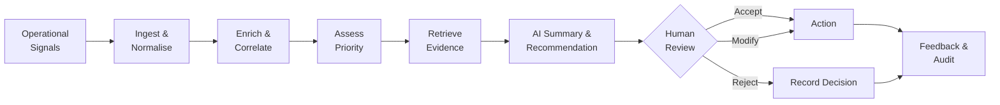
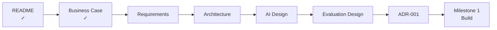

# Signaly — Business Case

> **AI-Assisted Operational Intelligence for Faster, Evidence-Grounded Decisions**

| | |
|---|---|
| **Project** | Signaly |
| **Document** | Business Case |
| **Milestone** | 0 — Product Foundation |
| **Status** | Complete |
| **Version** | 1.0 |

---

## 1. Business Problem

Modern digital services generate thousands of operational signals across application logs, monitoring platforms, APIs, infrastructure and customer-support systems.

The problem is not the absence of information.

**The problem is turning that information into a reliable decision quickly.**

When an operational issue occurs, an analyst may need to:

1. inspect the original alert;
2. search logs and monitoring systems;
3. identify related events;
4. determine which services are affected;
5. assess severity and priority;
6. decide what should happen next.

This creates three important business problems:

- **Investigation overhead** — valuable engineering time is spent gathering and correlating information.
- **Decision inconsistency** — prioritisation can depend heavily on individual experience.
- **Alert fatigue** — important events can become difficult to distinguish from operational noise.

As systems grow, simply generating more alerts does not solve the problem.

Teams need help identifying **what matters, why it matters and what to do next**.

---

## 2. Product Opportunity

**Signaly** is an AI-assisted operational intelligence platform that transforms fragmented operational signals into **prioritised, evidence-grounded and explainable decision support**.

Signaly sits between operational data sources and the people responsible for making decisions.

Rather than replacing monitoring platforms, it adds an intelligence layer that helps operators answer:

> **What is happening? How important is it? What evidence supports that conclusion? What should we do next?**

### Core Value Proposition

> **Less time investigating signals. More confidence deciding what matters.**

---

## 3. How Signaly Works

The workflow deliberately combines conventional software and AI.

Deterministic components handle tasks such as validation, workflow state and auditability.

AI is introduced where it can add measurable value, including correlation, contextual understanding, evidence retrieval, summarisation and recommendation support.

**Human operators remain responsible for consequential decisions.**

---

## 4. Who Is Signaly For?

The initial product is designed around operational teams responsible for maintaining digital services.

| User | Current Challenge | Signaly Value |
|---|---|---|
| **Operations Analyst** | Repetitive investigation | Consolidated context and evidence |
| **Incident Manager** | Inconsistent prioritisation | Structured priority assessment |
| **Engineer** | Fragmented technical information | Relevant evidence in one workflow |
| **Service Owner** | Limited incident visibility | Clearer operational context |
| **Technical Leadership** | Difficult-to-measure operational efficiency | Traceable decision and performance data |

---

## 5. MVP Scope

Signaly will begin with **one narrow but complete decision-support workflow**.

> **Signal → Context → Correlation → Priority → Evidence → Recommendation → Human Decision → Feedback**

### The MVP Will

- ingest structured operational signals;
- validate and normalise incoming events;
- enrich events with relevant context;
- identify potentially related signals;
- estimate operational priority;
- retrieve supporting evidence;
- generate evidence-grounded summaries;
- recommend possible next actions;
- communicate confidence or uncertainty;
- allow a human to accept, modify or reject recommendations;
- maintain an auditable decision record.

### The MVP Will Not

Signaly will **not initially**:

- replace existing observability platforms;
- automatically remediate production infrastructure;
- operate unrestricted autonomous agents;
- guarantee root-cause identification;
- remove humans from consequential decisions;
- attempt to reproduce a full commercial incident-management platform.

This boundary keeps the first implementation **focused, testable and achievable**.

---

## 6. Business Hypothesis

The project is built around one primary hypothesis:

> **Providing operators with correlated, contextualised and evidence-grounded AI assistance can reduce investigation effort while maintaining or improving decision quality.**

Signaly must therefore prove more than its ability to generate convincing AI responses.

It must demonstrate measurable operational value.

---

## 7. How We Will Measure Value

The MVP will be evaluated against a defined baseline representing the same workflow **without Signaly assistance**.

| Evaluation Area | Key Question |
|---|---|
| **Investigation Effort** | Does Signaly reduce the time or steps required to investigate an event? |
| **Prioritisation** | Does Signaly correctly identify important events? |
| **Correlation** | Can Signaly correctly associate related signals? |
| **Evidence Grounding** | Are AI conclusions supported by available evidence? |
| **Recommendation Quality** | Are suggested actions relevant and useful? |
| **Uncertainty** | Does the system communicate when confidence is limited? |
| **Reliability** | Does the workflow remain predictable when AI components fail? |

Specific metrics, datasets, thresholds and experimental procedures will be defined separately in:

`docs/EVALUATION_DESIGN.md`

This prevents proposed targets from being confused with achieved results.

---

## 8. Product Principles

Five principles guide Signaly's design.

### 1. Evidence Before Generation

AI outputs should be grounded in available operational evidence rather than generated from context-free prompts.

### 2. Human Control

AI provides decision support. Humans retain authority over consequential actions.

### 3. AI Where It Adds Value

Not every problem requires AI. Deterministic software should be preferred when deterministic logic is sufficient.

### 4. Measurable Improvement

An AI feature is valuable only if its contribution can be evaluated against an appropriate baseline.

### 5. Traceability

Important signals, evidence, recommendations and human decisions should be auditable.

---

## 9. Key Risks

| Risk | Design Response |
|---|---|
| AI generates unsupported information | Evidence grounding and output validation |
| Important signal receives low priority | Human review and priority evaluation |
| Unrelated events are incorrectly correlated | Correlation evaluation against labelled scenarios |
| Users over-trust AI recommendations | Evidence and uncertainty displayed with recommendations |
| AI service becomes unavailable | Graceful fallback to deterministic workflow |
| Poor input data affects decisions | Schema validation and data-quality checks |

These risks will influence both the architecture and evaluation strategy.

---

## 10. Success Definition

The Signaly MVP succeeds if it demonstrates a **complete and reproducible operational decision-support workflow** that:

- reduces unnecessary investigation effort;
- provides useful contextual evidence;
- supports reliable prioritisation;
- produces evidence-grounded AI outputs;
- communicates uncertainty;
- preserves human oversight;
- records decisions for later evaluation and audit.

A system that merely produces convincing AI-generated text **does not satisfy the success criteria**.

The project must produce evidence that the technology improves at least one meaningful part of the operational workflow without introducing unacceptable risk elsewhere.

---

## 11. Business Decision

### **Decision: PROCEED**

The problem is sufficiently defined to justify an MVP.

The proposed solution has:

- a clear user;
- a defined operational problem;
- a bounded product scope;
- measurable hypotheses;
- identifiable risks;
- explicit success criteria.

The next stage is to translate this business case into **testable product and engineering requirements**.

---

## 12. Milestone 0 Roadmap

### Next Document

**`docs/REQUIREMENTS.md`**

The requirements phase will define exactly **what Signaly must do** before implementation decisions are made.

---

> **Signaly**  
> *From operational noise to evidence-grounded action.*
