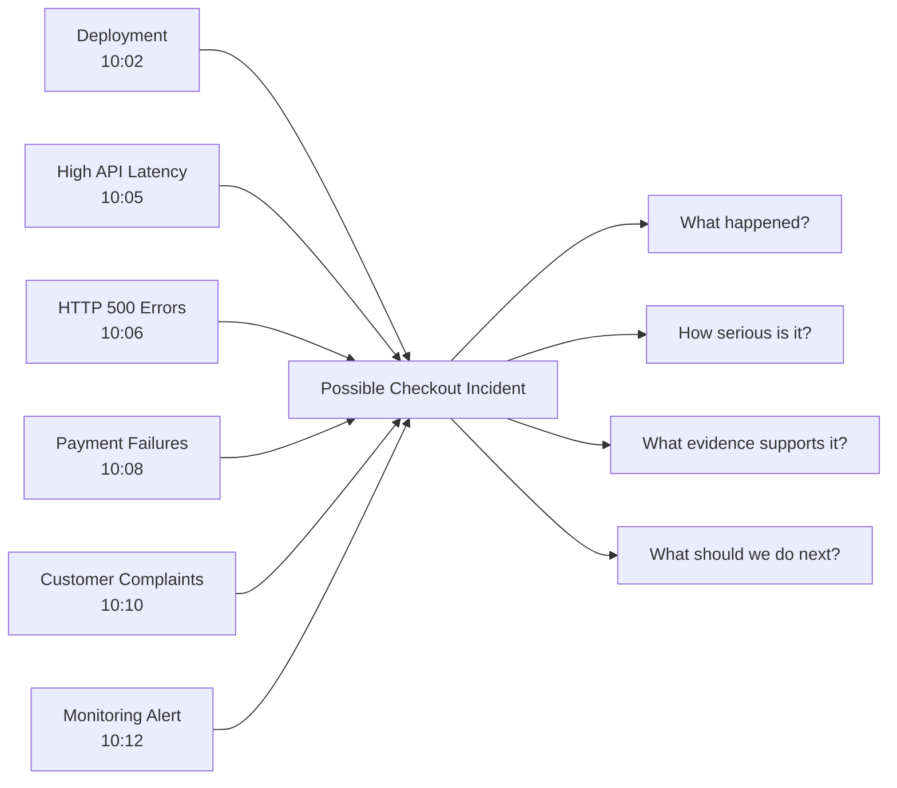
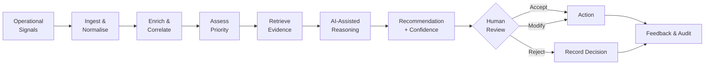
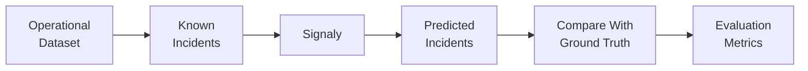
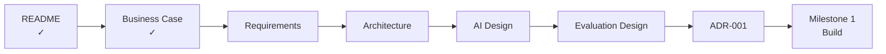

# Signaly — Business Case

> **From operational noise to evidence-grounded action.**

| | |
|---|---|
| **Project** | Signaly |
| **Document** | Business Case |
| **Milestone** | 0 — Product Foundation |
| **Version** | 1.0 |
| **Status** | Complete |

---

## 1. The Problem

Modern digital services continuously generate information from applications, APIs, cloud infrastructure, monitoring tools, deployments and customer-support systems.

We call each useful piece of this information an **operational signal**.

An operational signal is simply:

> **An event or observation that tells us something has happened — or may be going wrong — within a digital service.**

Examples include:

- an API becoming unusually slow;
- payment failures increasing;
- HTTP 500 errors appearing;
- a database connection failing;
- CPU usage reaching 95%;
- customers reporting that checkout is broken;
- a service becoming unavailable;
- a deployment occurring shortly before errors increase.

The challenge is not generating more signals.

The challenge is determining:

> **Which signals belong together, what is happening, how important it is, what evidence supports the conclusion, and what should happen next?**

---

## 2. A Concrete Example

Consider an online retailer.

Shortly after a new checkout release, several systems begin reporting problems:

| Time | Source | Operational Signal |
|---|---|---|
| 10:02 | Deployment | `checkout-service v2.4 deployed` |
| 10:05 | API Monitoring | Checkout latency rises to `4.2 seconds` |
| 10:06 | Application Logs | HTTP 500 errors increase |
| 10:08 | Payment Service | Payment failure rate reaches `17.2%` |
| 10:10 | Customer Support | Customers report failed payments |
| 10:12 | Monitoring | Checkout degradation alert triggered |

These signals may appear in different tools and initially look like separate problems.

An operator must investigate them, determine whether they are related, assess the impact and decide what to do.

That creates a correlation problem:

At scale, teams may have thousands of signals competing for attention.

This creates:

- **alert fatigue**;
- repetitive manual investigation;
- fragmented operational context;
- inconsistent prioritisation;
- slower incident response;
- dependence on experienced operators.

---

## 3. The Signaly Opportunity

**Signaly** is an AI-assisted operational intelligence platform designed to transform fragmented operational signals into:

> **correlated, prioritised, evidence-grounded and explainable decision support.**

Signaly does not aim to replace monitoring platforms.

Instead, it provides an intelligence layer between operational data and the people responsible for making decisions.

Using the checkout example, Signaly should eventually be capable of presenting something closer to:

> ### Potential Checkout Incident — High Priority
>
> Payment failures increased shortly after the latest checkout deployment.
>
> API latency, HTTP 500 errors and customer complaints increased during the same period.
>
> **Supporting evidence:** deployment event, latency metrics, application errors, payment failures and customer reports.
>
> **Suggested next step:** investigate the latest checkout deployment and compare service behaviour before and after release.
>
> **Confidence:** High
>
> **Decision:** Human review required.

The purpose is not simply to generate text.

The purpose is to help an operator reach a **better-supported decision faster**.

---

## 4. How Signaly Works

Signaly deliberately combines **traditional software, machine learning, retrieval and generative AI**.

AI will only be introduced where it provides measurable value.

Human operators remain responsible for consequential decisions.

---

## 5. Who Benefits?

| User | Problem | Signaly Value |
|---|---|---|
| **Operations Analyst** | Repetitive investigation | Consolidated context and evidence |
| **Incident Manager** | Difficult prioritisation | Structured incident assessment |
| **Engineer** | Information spread across systems | Relevant technical evidence |
| **Service Owner** | Limited incident visibility | Clearer operational context |
| **Technical Leadership** | Difficult-to-measure operational efficiency | Traceable performance and decision data |

---

## 6. MVP Scope

The first version of Signaly will focus on **one complete workflow**:

> **Signal → Context → Correlation → Priority → Evidence → Recommendation → Human Decision → Feedback**

### The MVP Will

- ingest structured operational signals;
- validate and normalise events;
- enrich events with relevant context;
- identify potentially related signals;
- assess operational priority;
- retrieve supporting evidence;
- generate evidence-grounded summaries;
- recommend possible next actions;
- communicate confidence or uncertainty;
- allow recommendations to be accepted, modified or rejected;
- maintain an auditable decision record.

### The MVP Will Not

Signaly will not initially:

- replace existing observability platforms;
- automatically remediate production infrastructure;
- operate unrestricted autonomous agents;
- guarantee root-cause identification;
- remove humans from consequential decisions;
- attempt to reproduce an entire commercial incident-management platform.

This keeps the MVP **focused, testable and achievable**.

---

## 7. Business Hypothesis

Signaly is built around one primary hypothesis:

> **Providing operators with correlated, contextualised and evidence-grounded AI assistance can reduce investigation effort while maintaining or improving decision quality.**

This hypothesis must be tested.

A convincing AI response alone will **not** be considered evidence that Signaly works.

---

## 8. Data & Validation Strategy

Signaly requires data to demonstrate whether its approach actually works.

The initial project will use **labelled synthetic operational scenarios** where the correct incident relationships are known.

For example, a checkout scenario may contain:

- related deployment events;
- latency changes;
- application errors;
- payment failures;
- customer complaints;
- unrelated background signals.

Because the expected relationships are known, Signaly's output can be compared against **ground truth**.

As the project develops, appropriate public observability datasets may also be introduced to test the system against more realistic telemetry.

This creates an evidence chain:

The detailed dataset, benchmark and experimental methodology will be defined in:

`docs/EVALUATION_DESIGN.md`

---

## 9. How We Will Measure Value

The Signaly-assisted workflow will be compared with a defined baseline.

| Evaluation Area | Question |
|---|---|
| **Investigation Effort** | Does Signaly reduce investigation time or steps? |
| **Critical-Event Detection** | Does Signaly correctly surface important events? |
| **Correlation Quality** | Does it correctly associate related signals? |
| **Prioritisation** | Are important incidents ranked appropriately? |
| **Evidence Grounding** | Are AI conclusions supported by available evidence? |
| **Recommendation Quality** | Are suggested actions relevant and useful? |
| **Uncertainty** | Does Signaly recognise when confidence is limited? |
| **Reliability** | What happens when an AI component fails? |

Specific metrics and thresholds will be established during evaluation design rather than claimed before experiments have been performed.

---

## 10. Product Principles

Signaly will follow five core principles.

### Evidence Before Generation

AI-generated conclusions should be grounded in available operational evidence.

### Human Control

AI provides decision support. Humans retain authority over consequential actions.

### AI Where It Adds Value

Deterministic software should be preferred when deterministic logic is sufficient.

### Measurable Improvement

AI capabilities must demonstrate value against an appropriate baseline.

### Traceability

Important signals, evidence, recommendations and human decisions should remain auditable.

---

## 11. Key Risks

| Risk | Design Response |
|---|---|
| AI generates unsupported information | Evidence grounding and output validation |
| Important event receives low priority | Human review and priority evaluation |
| Unrelated signals are incorrectly correlated | Ground-truth correlation testing |
| Users over-trust AI | Evidence and uncertainty shown with recommendations |
| AI component becomes unavailable | Graceful deterministic fallback |
| Poor input data affects decisions | Schema validation and data-quality checks |

These risks will influence the architecture, AI design and evaluation strategy.

---

## 12. Success Definition

The Signaly MVP succeeds if it demonstrates a **complete, reproducible and measurable operational decision-support workflow**.

It should provide evidence that Signaly can:

- reduce unnecessary investigation effort;
- correctly associate useful operational signals;
- support meaningful prioritisation;
- retrieve relevant evidence;
- produce evidence-grounded AI outputs;
- communicate uncertainty;
- preserve human oversight;
- maintain traceable decisions.

> **Generating convincing AI text is not success. Demonstrating measurable decision-support value is.**

---

## 13. Business Decision

### **PROCEED**

The project now has:

- a clearly defined problem;
- identifiable users;
- a concrete use case;
- a bounded MVP;
- a measurable hypothesis;
- a validation strategy;
- known risks;
- explicit success criteria.

The next stage will translate this business case into **testable system requirements**.

---

## Milestone 0

### Next

**`docs/REQUIREMENTS.md`**

The requirements document will define exactly **what Signaly must do** before we decide exactly **how it will be built**.

---

> **Signaly** — *From operational noise to evidence-grounded action.*
