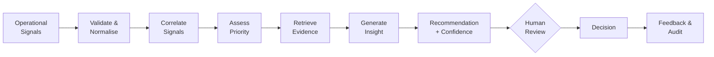
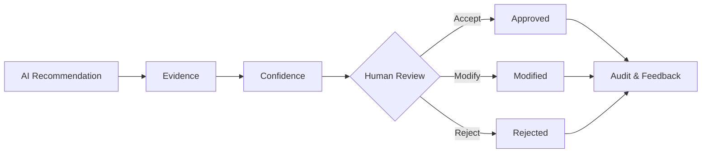
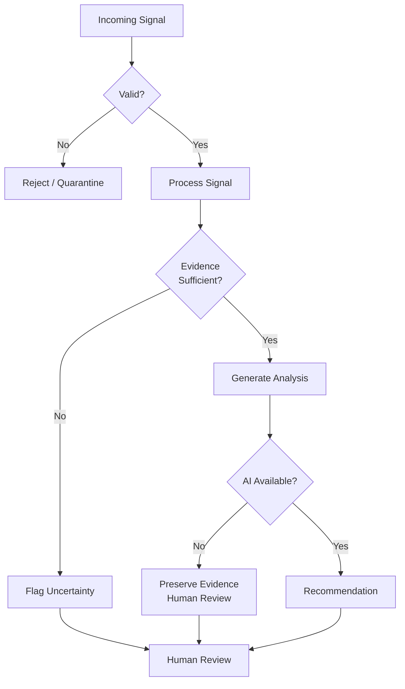
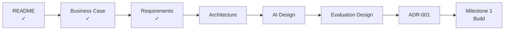

# Signaly — MVP Requirements

> **From operational noise to evidence-grounded action.**

| | |
|---|---|
| **Project** | Signaly |
| **Document** | MVP Requirements |
| **Milestone** | 0 — Product Foundation |
| **Version** | 1.0 |
| **Status** | Baseline |
| **Source** | `docs/BUSINESS_CASE.md` |

---

## 1. Purpose

This document defines what the **Signaly MVP must do and prove**.

Signaly is an AI-assisted operational intelligence platform that transforms fragmented operational signals into:

> **correlated incidents, prioritised insights, supporting evidence and human-reviewed recommendations.**

These requirements intentionally define **what the system must achieve**, not which technologies must be used.

Technology choices will be justified later in the architecture and decision records.

---

## 2. MVP Goal

The MVP must demonstrate one complete decision-support workflow:



### Example

Given the following signals:

- checkout deployment completed;
- API latency increased;
- HTTP 500 errors increased;
- payment failures increased;
- customers reported failed payments;

Signaly should be capable of determining that these signals **may represent one operational incident**, gathering the relevant evidence and presenting the incident to an operator for review.

---

# 3. Core Functional Requirements

These requirements define the minimum end-to-end Signaly workflow.

| ID | Requirement | Priority | Verification |
|---|---|---|---|
| **FR-001** | Accept structured operational signals through a defined ingestion interface. | Must | Integration Test |
| **FR-002** | Validate incoming signals and reject or quarantine invalid data safely. | Must | Automated Test |
| **FR-003** | Convert accepted signals into a consistent internal representation. | Must | Automated Test |
| **FR-004** | Associate potentially related signals with an incident candidate. | Must | Benchmark |
| **FR-005** | Assess the operational priority of an incident candidate. | Must | Benchmark |
| **FR-006** | Retrieve evidence relevant to an incident. | Must | Retrieval Test |
| **FR-007** | Generate an evidence-grounded incident summary. | Must | AI Evaluation |
| **FR-008** | Recommend a possible next action when sufficient evidence exists. | Must | AI Evaluation |
| **FR-009** | Display supporting evidence and confidence/uncertainty with the recommendation. | Must | Integration Test |
| **FR-010** | Allow an operator to accept, modify or reject a recommendation. | Must | Integration Test |
| **FR-011** | Record recommendations, evidence and human decisions for audit and evaluation. | Must | Integration Test |

---

# 4. AI Trustworthiness Requirements

AI is a component of Signaly — not the source of truth.

| ID | Requirement | Verification |
|---|---|---|
| **AI-001** | Generated conclusions must be grounded in evidence available to Signaly. | Grounding Evaluation |
| **AI-002** | Generated output must distinguish observed evidence from inferred conclusions. | AI Evaluation |
| **AI-003** | Recommendations must expose the evidence used to support them. | Integration Test |
| **AI-004** | Signaly must communicate uncertainty when available evidence is insufficient or conflicting. | Scenario Test |
| **AI-005** | Machine-consumed AI outputs must use validated structured responses. | Schema Test |
| **AI-006** | Failure of the AI component must not remove access to the underlying incident and evidence. | Failure Test |
| **AI-007** | AI performance claims must be supported by recorded evaluation results. | Evaluation Evidence |

### Design Principle

> **Signaly should know when the available evidence is not strong enough to justify a confident recommendation.**

---

# 5. Human Oversight

Signaly is a **decision-support system**, not an autonomous remediation platform.

| ID | Requirement |
|---|---|
| **HITL-001** | Consequential MVP recommendations require human review. |
| **HITL-002** | Operators can inspect supporting evidence before deciding. |
| **HITL-003** | Operators can accept, modify or reject recommendations. |
| **HITL-004** | Human decisions are recorded as feedback for later evaluation. |

The MVP therefore follows:



---

# 6. Data Requirements

Signaly requires controlled data to test whether the system actually works.

### Minimum Signal Fields

Every normalised signal must contain at least:

| Field | Purpose |
|---|---|
| `signal_id` | Unique signal identifier |
| `timestamp` | When the event occurred |
| `source` | System that produced the signal |
| `service` | Affected service/component |
| `signal_type` | Type of operational event |
| `message` | Human-readable event description |

Additional fields may include severity, environment, numeric values and metadata.

### Example

```json
{
  "signal_id": "sig_001",
  "timestamp": "2026-10-07T10:05:00Z",
  "source": "api_monitoring",
  "service": "checkout-service",
  "signal_type": "latency",
  "severity": "warning",
  "message": "Checkout API latency exceeded normal range",
  "value": 4200,
  "unit": "ms"
}
```

### Evaluation Data Requirements

| ID | Requirement |
|---|---|
| **DATA-001** | Evaluation scenarios must contain independently defined ground truth. |
| **DATA-002** | Ground truth must identify related signals and known incidents where applicable. |
| **DATA-003** | Evaluation data must contain unrelated/noise signals. |
| **DATA-004** | Synthetic datasets must be reproducible from controlled configuration or seeds. |
| **DATA-005** | Results must clearly distinguish synthetic, public and real-world data sources. |

---

# 7. Reliability & Failure Behaviour

A trustworthy decision-support system must remain useful when individual components fail.

| ID | Requirement |
|---|---|
| **REL-001** | Invalid signals must not crash the processing pipeline. |
| **REL-002** | Failure of an AI provider must not destroy or hide incident evidence. |
| **REL-003** | Insufficient evidence must result in uncertainty or escalation rather than fabricated certainty. |
| **REL-004** | Processing failures must produce diagnosable error information. |

### Safe Failure Path



> **Signaly should fail safely rather than fail confidently.**

---

# 8. Security & Governance

The MVP must establish secure engineering foundations even if it is not yet a production deployment.

| ID | Requirement |
|---|---|
| **SEC-001** | Inputs must be validated before processing. |
| **SEC-002** | Secrets and credentials must never be committed to source control. |
| **SEC-003** | Sensitive information must not be unnecessarily sent to external AI services. |
| **SEC-004** | Significant AI recommendations and human decisions must be traceable. |
| **SEC-005** | Production-style access controls must be introduced before exposing protected operational functionality. |

---

# 9. Engineering Quality Requirements

| ID | Requirement |
|---|---|
| **ENG-001** | Ingestion, correlation, prioritisation, retrieval and AI reasoning must remain logically separated. |
| **ENG-002** | External providers should be accessed through replaceable interfaces where practical. |
| **ENG-003** | Core behaviour must have automated tests. |
| **ENG-004** | The repository must provide reproducible setup and execution instructions. |
| **ENG-005** | The application must expose sufficient logs to diagnose failures. |
| **ENG-006** | End-to-end processing latency must be measurable. |

These requirements allow the project to evolve without prematurely introducing unnecessary infrastructure.

---

# 10. Evaluation Requirements

Signaly must be **measured**, not simply demonstrated.

| ID | What Must Be Evaluated |
|---|---|
| **EVAL-001** | Signal correlation performance |
| **EVAL-002** | Critical-incident detection |
| **EVAL-003** | Incident prioritisation |
| **EVAL-004** | Evidence retrieval quality |
| **EVAL-005** | AI summary grounding |
| **EVAL-006** | Unsupported AI claims |
| **EVAL-007** | End-to-end processing latency |
| **EVAL-008** | Signaly-assisted workflow versus baseline |

Detailed metrics, datasets, thresholds and experimental methodology belong in:

`docs/EVALUATION_DESIGN.md`

Negative or inconclusive results must be reported rather than removed.

---

# 11. MVP Acceptance Criteria

The Signaly MVP is complete only when the following workflow can be demonstrated and evaluated:

- [ ] Structured operational signals can enter the system.
- [ ] Invalid signals are handled safely.
- [ ] Related signals can be grouped into incident candidates.
- [ ] Incidents can be prioritised.
- [ ] Relevant evidence can be retrieved.
- [ ] An evidence-grounded summary can be generated.
- [ ] A recommended action can be presented where appropriate.
- [ ] Evidence and uncertainty are visible to the operator.
- [ ] The operator can accept, modify or reject the recommendation.
- [ ] The decision is recorded.
- [ ] Core behaviour is covered by automated tests.
- [ ] Evaluation can be reproduced.

---

# 12. Out of Scope for MVP

The following capabilities are deliberately excluded from the first implementation:

- autonomous infrastructure remediation;
- unrestricted autonomous agents;
- replacement of commercial observability platforms;
- guaranteed root-cause analysis;
- foundation-model training;
- enterprise-scale multi-region infrastructure;
- unnecessary microservice decomposition.

These may only be considered later if supported by evidence and product need.

---

# 13. Requirements Traceability

Every important capability should eventually have an evidence trail.


A reviewer should eventually be able to ask:

> **Where is this requirement implemented, how was it tested, and what evidence demonstrates that it works?**

A formal traceability matrix will be introduced once implementation begins.

---

# 14. Technology Neutrality

This document deliberately does **not** require:

- FastAPI;
- PostgreSQL;
- Kafka;
- Redis;
- a vector database;
- a particular LLM;
- Kubernetes;
- AWS, Azure or GCP.

Those are implementation choices, not business requirements.

Each significant technology introduced into Signaly must answer:

> **Which requirement does this technology help us satisfy, and why is it preferable to a simpler alternative?**

Major architectural decisions will be recorded using Architecture Decision Records (ADRs).

---

# 15. Next Step

The Business Case defines **why Signaly should exist**.

This document defines **what Signaly must do**.

The next document will define **how the system should be structured to satisfy these requirements**.

## Next Document

**`docs/ARCHITECTURE.md`**

---

## Milestone 0 Progress



---

> **Signaly** — *Build only what we can explain, test and evaluate.*
