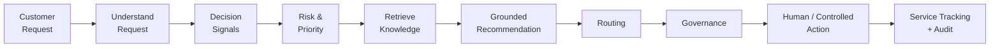
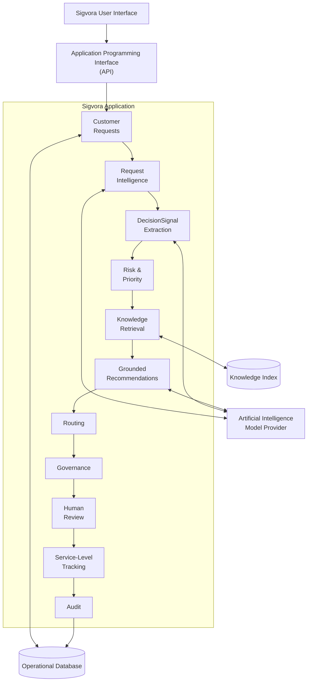
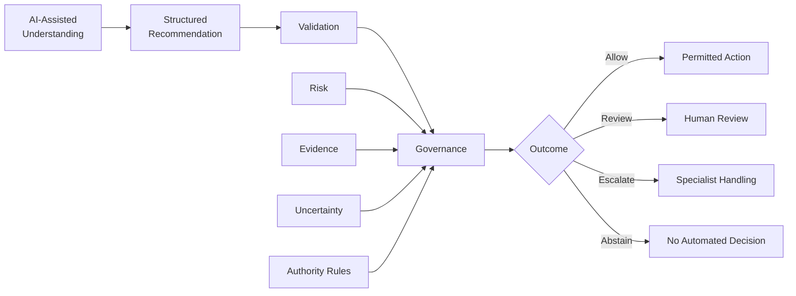
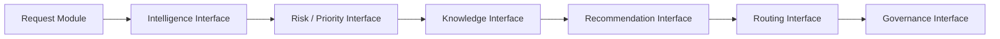
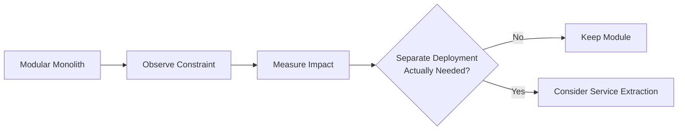
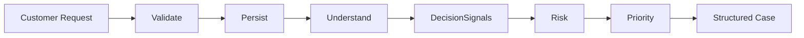
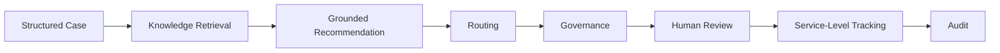

# Architecture Decision Record 001 (ADR-001)
## Why Sigvora Starts as a Modular Monolith

> **Status:** Accepted  
> **Date:** 2026-10-07  
> **Project:** Sigvora  
> **Decision:** Build the initial Sigvora backend as a modular monolith  
> **Scope:** Core customer-request intelligence and decision-support application

---

## 1. What Is an Architecture Decision Record?

An **Architecture Decision Record (ADR)** is a short document that records
an important technical decision made during the development of a system.

It explains:

- what decision was made;
- why the decision was necessary;
- what alternatives were considered;
- why one option was selected;
- what disadvantages or trade-offs were accepted;
- and when the decision should be reconsidered.

The number `001` means that this is the **first recorded architecture
decision for Sigvora**.

This document records why Sigvora will initially be built as a
**modular monolith** rather than as a collection of microservices.

---

## 2. Sigvora Product Context

Sigvora is a **Trustworthy AI customer-request intelligence and
decision-support platform**.

Its purpose is to help organisations:

> **understand, prioritise, route and safely act on customer requests
> using evidence-grounded Artificial Intelligence, organisational
> knowledge and explicit governance controls.**

A typical customer request moves through the following process:



Although these responsibilities are connected, they perform different
jobs and need clear software boundaries.

The architectural question is therefore:

> **Should Sigvora begin as one organised application containing
> separate modules, or should these responsibilities immediately become
> independently deployed services?**

---

## 3. Decision

Sigvora will initially use a:

> **Modular Monolith**

### What does "Modular Monolith" mean?

A modular monolith is:

> **One deployable application whose internal responsibilities are
> separated into clearly defined software modules.**

This means Sigvora can initially run as one backend application while
still separating responsibilities such as:

```text
Customer Requests
Request Intelligence
Decision Signals
Risk
Priority
Knowledge Retrieval
Recommendations
Routing
Governance
Human Review
Service-Level Tracking
Audit
```

The word **monolith** does not mean that all code should be placed in one
large file or mixed together.

The word **modular** is important.

Each major responsibility should have a clear purpose and controlled
relationship with other parts of the system.

---

## 4. What This Looks Like

Conceptually:



### What does this diagram mean?

The **User Interface** is where an employee can view customer requests,
evidence, recommendations, routing decisions and cases requiring review.

The **Application Programming Interface (API)** is the controlled way
the frontend communicates with the backend application.

The **Sigvora application** contains the business capabilities that turn
a customer request into structured decision support.

The **operational database** stores customer cases and their decision
history.

The **knowledge index** helps Sigvora search approved organisational
knowledge.

The **Artificial Intelligence model provider** supports language
understanding and recommendation tasks where AI is appropriate.

These components support one product:

> **customer-request intelligence and decision support.**

---

## 5. Why Sigvora Needs Separate Modules

Consider this customer request:

> "My card was stolen yesterday and there are three transactions
> totalling £650 that I don't recognise."

Sigvora may need to determine:

```text
Intent
Potential Fraud

Decision Signals
Stolen Card
Unrecognised Transactions
£650 Financial Exposure

Risk
High

Priority
P1

Relevant Knowledge
Approved Card / Fraud Procedure

Recommendation
Urgent specialist handling

Route
Fraud / Card Security

Governance
Escalate

Human Involvement
Required
```

These are related decisions, but they are not the same decision.

If all this logic is mixed together, it becomes difficult to determine
why Sigvora produced a particular result.

Separate modules make it easier to ask:

```text
Was the customer request understood incorrectly?

Was an important DecisionSignal missed?

Was the risk assessment wrong?

Was the wrong organisational evidence retrieved?

Was the recommendation unsupported?

Was the request routed incorrectly?

Did governance behave incorrectly?
```

This separation improves testing, debugging, evaluation and
explainability.

---

## 6. Why Not Build Everything as One Unstructured Application?

The simplest technical approach would be to put most logic together.

Conceptually:

```text
Customer Request
      ↓
Large Application Function
      ↓
AI
      ↓
Final Answer
```

This might be quick initially, but it creates significant problems for
Sigvora.

The system would become harder to:

- test;
- explain;
- evaluate;
- audit;
- maintain;
- and safely govern.

Most importantly, Artificial Intelligence reasoning could become mixed
with operational authority.

That conflicts with Sigvora's Trustworthy AI design.

Therefore an **unstructured monolith is rejected**.

---

## 7. What Are Microservices?

A **microservices architecture** divides an application into multiple
smaller services that can be deployed and operated independently.

For example, Sigvora could theoretically have:

```text
Customer Request Service

AI Intelligence Service

Risk Service

Knowledge Retrieval Service

Recommendation Service

Routing Service

Governance Service

Audit Service
```

Each service might have its own:

```text
Application
Deployment
Network Communication
Monitoring
Configuration
Scaling
Failure Handling
```

Microservices can be valuable when a system genuinely requires this
independence.

However, they also introduce additional complexity.

---

## 8. Why Sigvora Is Not Starting With Microservices

Sigvora currently has no measured evidence that it needs independently
deployed services.

Starting with microservices would introduce problems that do not yet
solve a demonstrated product requirement.

These include:

```text
Network communication

Service discovery

Distributed failures

Multiple deployments

More complex testing

Distributed tracing

Data consistency challenges

More infrastructure

Higher operational overhead
```

For a project whose immediate objective is to prove the quality of the
customer-request decision process, this would distract engineering effort
from the main problem.

The decision is therefore:

> **Do not introduce distributed-system complexity before Sigvora has a
> demonstrated reason to need it.**

---

## 9. Alternatives Considered

| Option | Meaning | Decision |
|---|---|---|
| Unstructured Monolith | One application with weak internal boundaries | Rejected |
| Modular Monolith | One application with clearly separated modules | **Accepted** |
| Microservices | Multiple independently deployed services | Not justified yet |

### Why the modular monolith wins

It provides the balance Sigvora currently needs:

```text
Simple Deployment
        +
Clear Responsibilities
        +
Strong Testing
        +
Lower Infrastructure Complexity
        +
Future Evolution
```

---

## 10. Proposed Internal Structure

The backend may eventually use a structure similar to:

```text
sigvora/
│
├── requests/
├── intelligence/
├── risk/
├── priority/
├── knowledge/
├── recommendations/
├── routing/
├── governance/
├── reviews/
├── sla/
├── audit/
└── shared/
```

These names are not final implementation requirements.

They show the intended separation of responsibilities.

### Example

The `knowledge` module should not decide whether a customer request is
allowed to proceed.

Its responsibility is knowledge retrieval.

The `governance` module should not perform customer-language
classification.

Its responsibility is deciding what the system is permitted to do.

Clear boundaries prevent responsibilities from becoming mixed.

---

## 11. Critical Boundary — Artificial Intelligence vs Governance

One of the most important boundaries in Sigvora is between:

```text
Artificial Intelligence
```

and:

```text
Operational Authority
```

Sigvora may use Artificial Intelligence to:

- understand customer language;
- identify DecisionSignals;
- interpret context;
- support knowledge retrieval;
- and generate evidence-grounded recommendations.

But the AI model should not decide whether its own recommendation is
authorised.



This implements a central Sigvora principle:

> **Artificial Intelligence capability does not equal operational
> authority.**

---

## 12. What Is Governance?

In Sigvora, **governance** means the rules and controls that determine
what the system is permitted to do.

For example, the AI may recommend:

```text
Escalate this customer request urgently.
```

Governance then considers factors such as:

```text
Risk
Evidence
Uncertainty
Action Type
Authority Rules
```

before determining:

```text
ALLOW

REVIEW

ESCALATE

ABSTAIN
```

This prevents the AI model from authorising itself.

---

## 13. What Is Human Review?

**Human review** means that an authorised person examines an AI-assisted
decision before a restricted or sensitive workflow continues.

For example:

```text
High-Risk Customer Request
        ↓
AI Recommendation
        ↓
Governance
        ↓
REVIEW
        ↓
Human Decision
```

The human may:

```text
Approve
Reject
Modify
Reroute
Escalate
```

The original AI recommendation should remain available for audit and
evaluation.

---

## 14. Data Strategy

Sigvora will initially use a relational database as the authoritative
source of customer-case information.

A likely implementation choice is **PostgreSQL**, an open-source
relational database system.

Conceptually:

```text
Operational Database
│
├── Customer Requests
├── Intent Classifications
├── DecisionSignals
├── Risk Assessments
├── Priority Assessments
├── Evidence References
├── Recommendations
├── Routing Decisions
├── Governance Decisions
├── Human Decisions
├── Service-Level State
└── Audit Events
```

This allows the system to reconstruct how a customer request was handled.

---

## 15. Knowledge Index vs Operational Database

These two components have different responsibilities.

### Operational Database

Stores:

```text
Customer Cases
Decisions
Statuses
Reviews
Audit History
```

It is the authoritative source for operational case state.

### Knowledge Index

Stores or indexes searchable representations of approved organisational
knowledge.

It supports **Retrieval-Augmented Generation (RAG)**.

Retrieval-Augmented Generation means:

> **Retrieving relevant organisational information before asking an AI
> model to generate a recommendation.**

The knowledge index is therefore a search mechanism.

It is not the authoritative customer-case database.

---

## 16. Communication Between Modules

Modules should communicate through explicit interfaces rather than
arbitrarily accessing each other's internal logic.

Conceptually:



An **interface** means a defined way for one part of the application to
request functionality from another part.

This helps keep responsibilities understandable and reduces accidental
coupling.

---

## 17. Benefits of This Decision

Starting with a modular monolith gives Sigvora:

- simpler deployment;
- lower infrastructure complexity;
- easier end-to-end testing;
- easier debugging;
- faster early development;
- clearer transaction handling;
- explicit business boundaries;
- and a practical path for future growth.

Most importantly, engineering effort remains focused on proving the
Sigvora customer-request decision process.

---

## 18. Trade-Offs

No architecture choice is free of disadvantages.

By choosing a modular monolith, Sigvora accepts:

- one primary backend deployment;
- shared application resources;
- the possibility of accidental module coupling;
- and less independent scaling than separate services.

These disadvantages are currently acceptable because there is no
evidence that Sigvora requires independent service deployment.

The architecture must still actively enforce module boundaries.

---

## 19. Risks and Mitigations

| Risk | What It Means | Mitigation |
|---|---|---|
| Module coupling | Different responsibilities become dependent on internal implementation details | Use explicit module interfaces |
| Shared database misuse | Every module directly changes unrelated data | Define ownership and controlled data access |
| AI/governance mixing | AI begins controlling its own authority | Keep governance separate and deterministic |
| Application growth | Backend becomes difficult to maintain | Periodic architecture review |
| Resource contention | One workload affects the rest of the application | Measure performance and resource usage |
| Difficult future extraction | Modules become impossible to separate | Maintain clear boundaries and contracts |

---

## 20. When Should This Decision Change?

Choosing a modular monolith now does not mean Sigvora must remain one
forever.

The architecture should be reconsidered if measured evidence shows that
a module requires:

```text
Independent Scaling

Independent Deployment

Different Availability Requirements

Stronger Security Isolation

Different Computing Requirements

Independent Team Ownership

Separate Release Cycles
```

For example, future knowledge-document processing might eventually
require significantly different computing resources from interactive
customer-request processing.

That could provide a genuine reason to separate it.

---

## 21. Evidence-Driven Evolution

Sigvora should not move to microservices simply because the application
becomes larger.

The decision should follow evidence.



The principle is:

> **Architecture complexity should be earned through demonstrated
> requirements.**

---

## 22. Consequence for the First Implementation

This decision means we can begin with one small but complete Sigvora
workflow rather than trying to implement every module simultaneously.

The first working vertical slice should be:



### What is a vertical slice?

A **vertical slice** is a small piece of the real product that works from
beginning to end.

Instead of separately building:

```text
all database functionality,
then all AI functionality,
then all frontend functionality,
```

we build enough of each required layer to make one real customer-request
workflow function.

This gives us something testable much earlier.

---

## 23. Future Expansion

After the first vertical slice works, the same customer case can be
extended through:



This keeps development centred on the Sigvora product journey.

---

## 24. Decision Summary

| Question | Decision |
|---|---|
| What architecture will Sigvora start with? | Modular Monolith |
| What does that mean? | One deployable application with clearly separated modules |
| Why? | Lower complexity while preserving strong boundaries |
| Why not an unstructured monolith? | Responsibilities would become difficult to test and govern |
| Why not microservices now? | No demonstrated requirement justifies the additional complexity |
| Can architecture change later? | Yes |
| What would trigger change? | Measured operational or technical requirements |
| How is AI treated? | Intelligence and recommendation capability |
| Who controls authority? | Governance rules and humans where required |
| Status | Accepted |

---

## 25. Final Decision

Sigvora will begin as a **modular monolith** because it provides the
simplest architecture that preserves the important boundaries required by
the product.

It allows Sigvora to concentrate on its real industry problem:

> **Turning unstructured customer requests into structured,
> evidence-grounded, risk-aware and governable decisions.**

The project will introduce additional architectural complexity only when
implementation evidence demonstrates that it is necessary.
